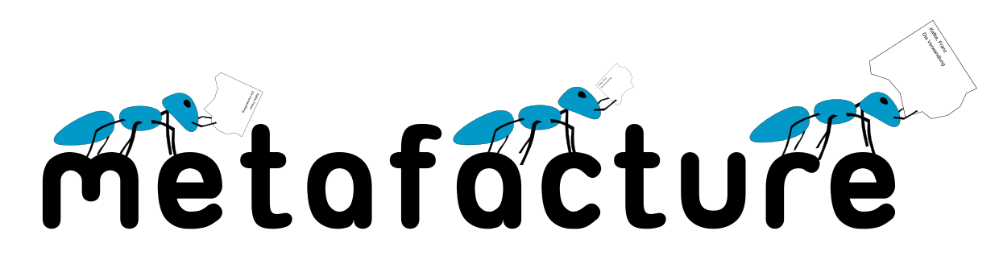
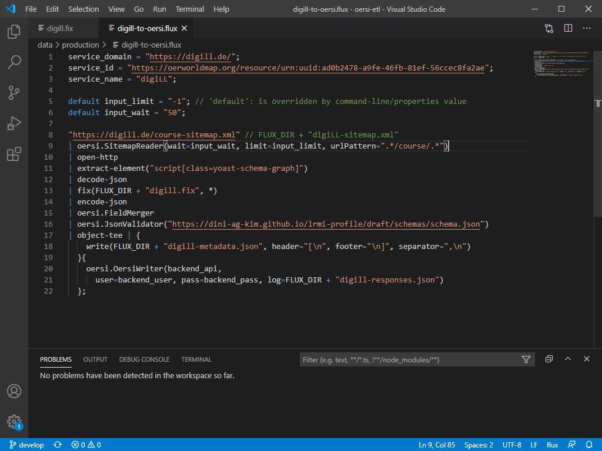
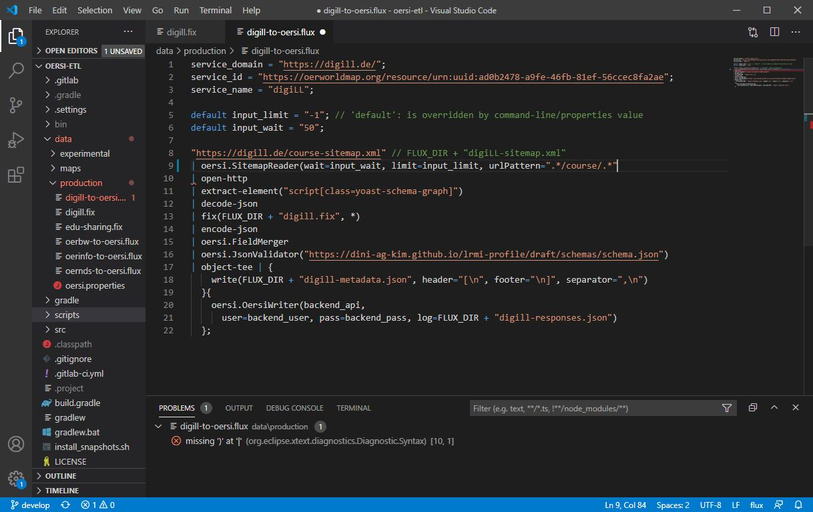
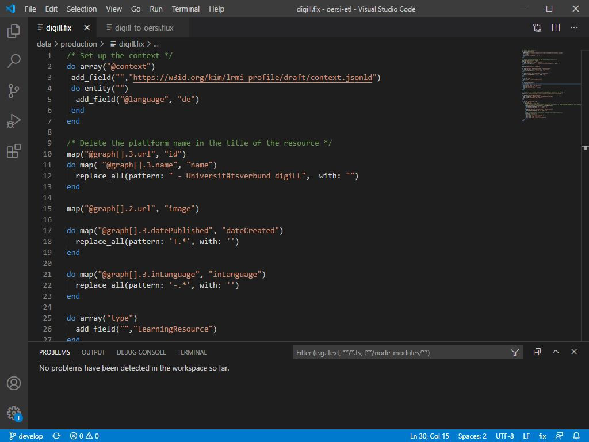
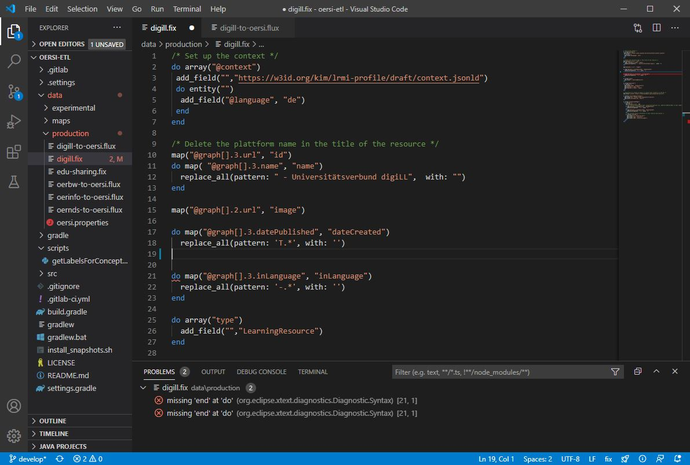

% Metafacture Extensions

## Overview
Here you will find different extensions and plugins related to the [Metafacture project](https://metafacture.org) in order to support working with the framework. At the current state we provide VS Code / Codium Extensions for the Fix language and the Flux language. Both extensions are aiming to support working with Fix and Flux by syntax highlighting, simple auto completion and validation of the Flux/Fix language.
As extensions are based on the [Language Server Protocol (LSP)](https://microsoft.github.io/language-server-protocol/), extensions and plugins for other IDEs than VS Code / Codium can easily be added in the future.

## Setup an extension
There are different ways to install extensions for VS Code / Codium.

1. The first one is to install from a marketplace. If you use VS Code, the default marketplace is [Visual Studio Marketplace](https://marketplace.visualstudio.com/vscode), for VS Codium it's [Open VSX Registry](https://open-vsx.org/). All extensions which are presented here are published to both marketplaces. Use the **Search Extensions in Marketplace** search box to search for **metafacture** in the Extensions view.

2. The second way to install is to download a VSIX file and install from it. You can download the latest version of the VSIX files for [Fix](https://wwww.metafacture.org/extensions/fix-0.0.1.vsix) and [Flux](https://wwww.metafacture.org/extensions/flux-0.0.1.vsix). Use the **Install from VSIX** command in the Extensions view drop-down menu and point to the downloaded VSIX.

## Usage

### Flux

After installing the extension to VS Code / Codium open a Flux file, for example [this one](https://gitlab.com/oersi/oersi-etl/-/raw/develop/data/production/digill-to-oersi.flux). It should look like this:

If you delete for example a necessary bracket you will see in the Problems section that the extention detects problems with the Flux file:

### Fix

After installing the extension to VS Code / Codium open a Flux file, for example [this one](https://gitlab.com/oersi/oersi-etl/-/raw/develop/data/production/digill.fix). It should look like this:

If you remove a closing `end` you will see in the Problems section that the extention detects the missing `end`:

## GitHub

To report issues, see the code, and contribute to the projects, visit: [Fix Repository](https://github.com/metafacture/metafacture-fix), [Flux Repository](https://github.com/metafacture/metafacture-flux).
